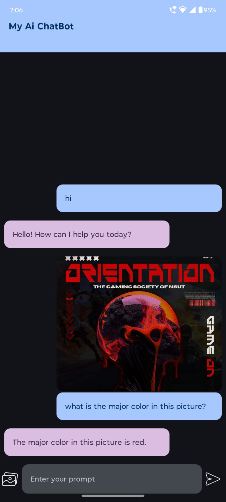
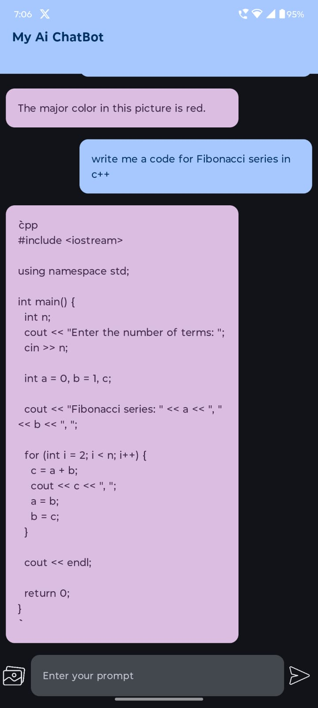
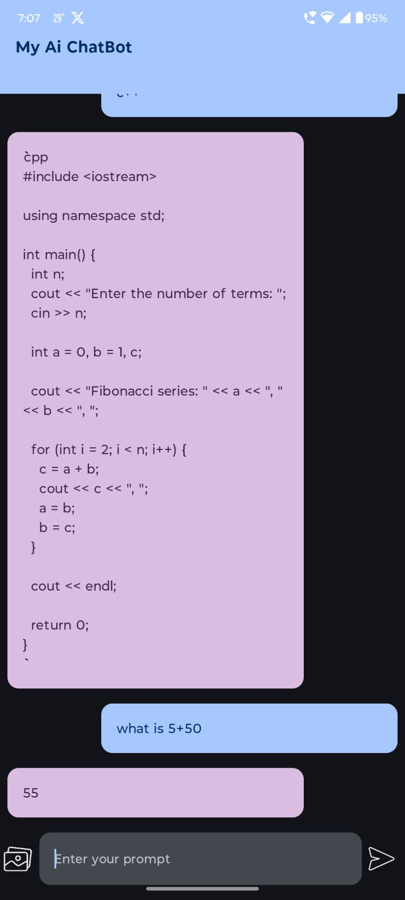
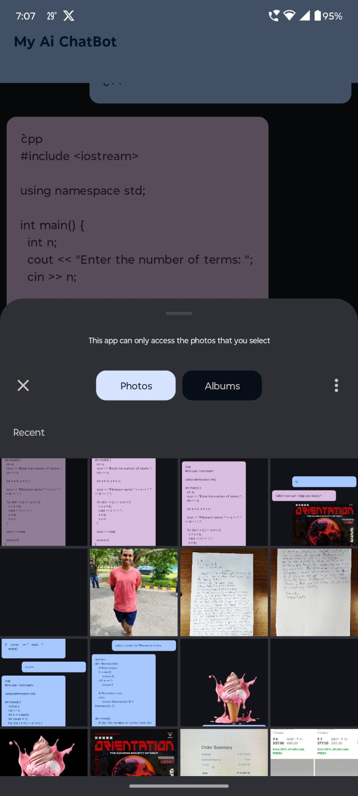

---

### 1. **Project Title**

**My AI ChatBot**

### 2. **Description**

This is an AI ChatBot application built using Kotlin and Jetpack Compose. The application allows users to input text or select an image, which is then processed by an AI model to generate a response. The user can interact with the bot through a simple, intuitive chat interface, and the application also supports image-based queries.

### 3. **Screen Shots**
   
<p align="center">
  
  
  
  
  
</p>
   

### 4. **Features**

- Text-based chat interaction with AI.
- Image-based input for generating AI responses.
- Copy-to-clipboard functionality for AI responses.
- Vibration feedback on long press to copy text.
- Clean, responsive UI built with Jetpack Compose.
- Supports selecting images from the device gallery.


### 5. **Installation**

1. **Clone the repository:**
   ```bash
   git clone https://github.com/yourusername/aichatbot.git
   ```
2. **Open the project in Android Studio.**
3. **Sync the project with Gradle files.**
4. **Run the application on an emulator or physical device.**

### 6. **Usage**

- **Launching the Application:**
  Open the app on your Android device. You will be greeted with a chat interface.
  
- **Text Interaction:**
  - Type a message in the input field at the bottom.
  - Click the send icon to submit your prompt to the AI model.
  - The response from the AI will appear in the chat interface.

- **Image Interaction:**
  - Click on the gallery icon to select an image from your device.
  - Once an image is selected, it will appear as a thumbnail above the input field.
  - Type a message related to the image and send it. The AI will respond considering the image content.

- **Copying AI Responses:**
  - Long-press on any AI-generated response to copy the text to your clipboard.
  - A vibration feedback will confirm the action.

### 7. **Tech Stack**

- **Language:** Kotlin
- **UI:** Jetpack Compose
- **Image Handling:** Coil
- **State Management:** Jetpack ViewModel, StateFlow
- **API:** Gemini AI 


